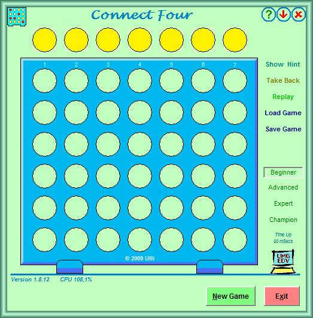



## Connect Four \(aka The Captain's Mistress\)

### Description

During his long sea voyages, Captain Cook was often absent in the evenings and eventually the crew began to joke that he must have a mistress in his cabin. When they discovered that the Captain had simply been playing this game with the ship's scientists, the game was christened "The Captain's Mistress". ~~ This program uses bitmaps to represent the Board, iterative Search deepening, Alpha-Beta pruning, and Principal Variation search. No positional evaluation is made at the search tree leaves, it simply relies on search depth to find winning combinations. Search depth is about 10 to 12 with a two seconds time check (Advanced level). The program is hard to beat even in Beginner mode. See Screenshot. ~~ Download is 33kB.
 
### More Info
 
Fun, Disappointment, Frustration, Anger(?)

             |
---                |---
**Submitted On**   |2009-04-01 02:32:06
**By**             |[ULLI](https://github.com/Planet-Source-Code/PSCIndex/blob/master/ByAuthor/ulli.md)
**Level**          |Advanced
**User Rating**    |5.0 (30 globes from 6 users)
**Compatibility**  |VB 6\.0
**Category**       |[Games](https://github.com/Planet-Source-Code/PSCIndex/blob/master/ByCategory/games__1-38.md)
**World**          |[Visual Basic](https://github.com/Planet-Source-Code/PSCIndex/blob/master/ByWorld/visual-basic.md)
**Archive File**   |[Connect\_Fo214822412009\.zip](https://github.com/Planet-Source-Code/ulli-connect-four-aka-the-captain-s-mistress__1-71858/archive/master.zip)

### API Declarations

a few

